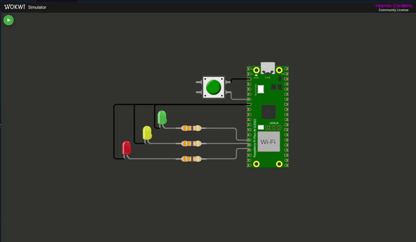
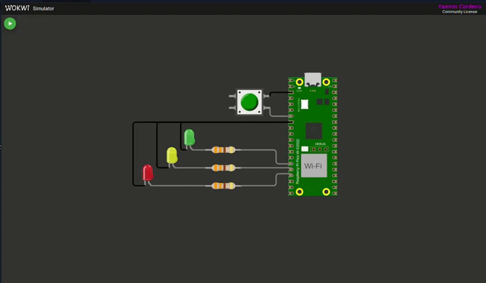

<div align="center">
    
</div>

<br>


<div align="center">

# Atividade 2: Temporizador de um Disparo (One Shot)

</div>


## Descrição
Este projeto implementa um sistema de temporização para acionamento de LEDs a partir do clique em um botão (pushbutton), utilizando a função `add_alarm_in_ms()` do Pico SDK. O objetivo é controlar o acionamento progressivo e o desligamento dos LEDs conforme um temporizador configurado para 3 segundos.

## Componentes Utilizados
- **Microcontrolador**: Raspberry Pi Pico W
- **LEDs**: Azul, vermelho e verde
- **Resistores**: 3 unidades de 330 Ω
- **Botão (Pushbutton)**

## Requisitos do Projeto
1. Ao pressionar o botão, todos os LEDs são ligados simultaneamente.
2. A cada 3 segundos (3000 ms), um LED é desligado, até que todos se apaguem.
3. A lógica de controle dos LEDs deve ser implementada dentro de funções de callback do temporizador, similar à `turn_off_callback()` abordada em aula.
4. O botão deve ser desativado enquanto o ciclo de temporização estiver em execução, permitindo uma nova interação apenas quando todos os LEDs estiverem apagados.
5. Deve-se realizar um experimento prático com a ferramenta BitDogLab, utilizando:
   - **LED RGB** nos GPIOs 11, 12 e 13
   - **Botão A** na GPIO 05
6. *(Opcional)*: Implementar debounce via software para reduzir o efeito bouncing no botão.

## Ambiente de Desenvolvimento
- **Editor**: VS Code
- **Linguagem**: C
- **SDK**: Pico SDK
- **Simulador**: Wokwi, integrado ao VS Code
- **Controle de Versão**: GitHub

## Como Executar o Projeto
1. **Clonar o Repositório**:

```bash
git clone https://github.com/yasmincsme/embarcatech-U4-ativ2.git

2. **Compilar e Carregar o Código**:
   No VS Code, configure o ambiente e compile o projeto com os comandos:

```bash	
cmake -G Ninja ..
ninja
```

3. **Interação com o Sistema**:
   - Conecte a placa ao computador.
   - Clique em run usando a extensão do raspberry pi pico.


## Testes

### **1. Teste básico**

- **Descrição:** Ao pressionar o botão A, todos os leds piscam (formando a cor branca) por 3 segundos, depois, apenas dois leds permanecem acessos (formando a cor roxa) e, por fim, resta apenas um led ligado (led vermelho). Após o fim da rotina, todos os leds permanecem desligados até que haja o acionamento do botão novamente.

**Teste no Software:**  


**Teste no Hardware:**  


### **2. Demonstração de continuidade**

- **Descrição:** O botão A é pressionada duas vezes.

**Teste no Software:**  


**Teste no Hardware:**  


### **3. Teste de interrupção**

- **Descrição:** O botão A é pressionado inúmeras vezes durante a execução da rotina para demonstrar que o acionamento do botão não interfere no programa durante o acionamento dos leds.

**Teste no Software:**  


**Teste no Hardware:**  


## Vídeo de Demonstração

[Clique aqui](https://youtu.be/tUTgC4oqwOw)

## Autor
Yasmin Cordeiro de Souza Meira
